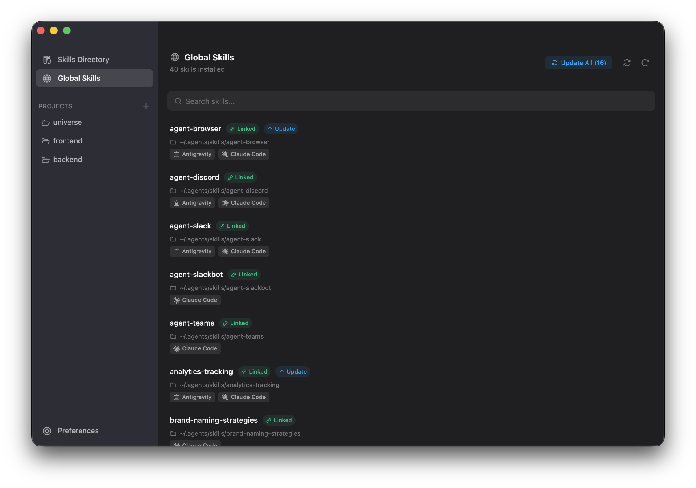

# SkillPad

A desktop GUI wrapper for the [skills.sh](https://skills.sh) CLI tool.



## Motivation

Agent skills are powerful, and the skills CLI works well — but not everyone lives in the terminal. SkillPad gives you a visual way to browse, install, and manage skills without touching the command line.

## Features

- Browse skills from skills.sh gallery
- Search skills with debounced filtering
- View skill details with markdown rendering
- Install skills to selected agents (global or project scope)
- Remove installed skills
- Manage multiple projects with drag-to-reorder
- Configure default agents in preferences
- Command palette for quick navigation
- Keyboard shortcuts for navigation
- Automatic dark/light theme (follows system preference)
- Auto-update with in-app notifications
- Window state persistence

## Installation

Download the latest version from [skillpad.dev/download](https://skillpad.dev/download).

## Usage

### Navigation

- **Skills Directory**: Browse all available skills from skills.sh
- **Global Skills**: View globally installed skills
- **Projects**: Import and manage project-specific skills

### Keyboard Shortcuts

- `Cmd/Ctrl + K` or `Cmd/Ctrl + P` - Open command palette
- `Cmd/Ctrl + F` - Focus search
- `Cmd/Ctrl + 1` - Navigate to Skills Directory
- `Cmd/Ctrl + 2` - Navigate to Global Skills
- `Cmd/Ctrl + 3-9` - Navigate to projects (1st-7th)
- `Cmd/Ctrl + Shift + [` - Previous tab
- `Cmd/Ctrl + Shift + ]` - Next tab
- `Cmd/Ctrl + ,` - Open Preferences

### Adding Skills

1. Browse or search for a skill in the Skills Directory
2. Click "Add" on the skill card
3. Select install targets (Global and/or Projects)
4. Select agents
5. Click "Add" to install

### Managing Projects

1. Click "Import" in the Projects section
2. Select a project folder
3. The project appears in the sidebar
4. Drag to reorder projects

## Building

### Development

```bash
bun run dev
```

### Production Build

```bash
# macOS (Universal binary)
bun run tauri build --target universal-apple-darwin

# Windows
bun run tauri build --target x86_64-pc-windows-msvc
```

## Development

### Running Tests

```bash
# Unit tests
bun run test

# E2E tests
bun run test:e2e
```

### Type Checking

```bash
bun run typecheck
```

### Linting & Formatting

```bash
bun run lint
bun run lint:fix
bun run format
```

### Clean Build Artifacts

```bash
bun run clean
```

## Links

- [Website](https://skillpad.dev)
- [Download](https://skillpad.dev/download)

## License

MIT
